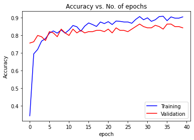

# Predict hand gestures using CNN (Python version)
## 研究目的
* 在VR、AR等技術發揚光大的現代，預測手勢是缺一不可之要素。而若想要實做手勢識別的功能，目前有許多方式可以達到此效果，EMG就是其中一項。
* EMG(肌電圖；英文全名為Electromyography)，是一種診斷醫學技術，主要用於評估和記錄骨骼肌產生的電位活動。當肌肉細胞被電或神經刺激時，EMG可以檢測它們產生的電位，進而可以對訊號進行分析以檢測醫療異常或進行運動力學分析。在現今科技中，肌電圖也被用作手勢識別的中間元素，透過將手部動作訊號輸入電腦並加以分析，可以達到許多實際功能，例如可運用在 VR、AR等領域中。
* 本研究將透過分析EMG訊號，加以過濾與處理，最後導入CNN中預測其代表之手勢，希望能達到僅透過EMG訊號就能預測手勢的目標。
## 資料來源
* 此研究之資料是由Kaggle網頁之 “[EMG Signal for gesture recognition](https://www.kaggle.com/datasets/sojanprajapati/emg-signal-for-gesture-recognition)" 資料集獲取；而網頁中的Induction中有提到，該資料集是源自於Sergey et al .(2018) 之 “[Latent Factors Limiting the Performance of sEMG-Interfaces](https://www.mdpi.com/1424-8220/18/4/1122/htm)”一文研究過程產生的資料。
* 在上述提到之論文中，研究者要求受試者配戴一手環，該手環上配有8個EMG感測器(如下圖)。接著，研究者會讓受試者比劃出不同手勢，藉此蒐集到8項來自不同感測器的訊號。

## 原始資料分析
* 資料筆數 : 共420萬筆資料左右
* 資料欄位 : 
    | 欄位名稱 | 資料屬性 | 說明 |
    | :------: | :------: | :------: |
    | time | integer | 偵測到該筆資料的時間點 |
    |channel 1 ~ 8|float|各個感測器讀取到的EMG訊號值|
    |class|string|0 : 未標記之資料 1 : 手靜止 2 : 手握拳頭 3 : 手腕彎曲 4 : 手腕伸展 5 : 手腕內傾 6 : 手腕外傾 7 : 手掌伸展 (不是每筆訊號都有)|
    |label|string|受試者編號|
## 資料前處理
1. 首先，由於原始資料過大，Colab無法處理，因此我自己將依照36位受試者分割成`S01.csv`至`S36.csv`。
2. 接著，每筆原始訊號包含了所有手勢，因此要根據不同手勢將訊號個別抓出來。
    * 下圖為單一訊號不同手勢之情況

3. 因為同一手勢的訊號長度不同，因此統一取訊號的前1050筆資料點，並依序透過調整基準線、使用帶通濾波器、取絕對值與使用低通濾波器來過濾訊號。

 

4. 由於本研究將採用 2D 的 CNN，因此我將每次測試 Channel 1 至 Channel 8 的訊號串在一起，進而產生出一筆 $1050\times 8$ 的 X data。
    * 下圖為隨意取六種手勢各一筆訊號出來，並將其視覺化

5. 最後將資料整理成適合丟入 CNN model 的模式 : 
    * 利用 `train_test_split()` 將資料切割成 `X_train`、`X_test`、`Y_train` 與 `Y_test` (切割比例為 train = 80%、test = 20%)
    * 再對 `Y_train` 與 `Y_test` 做 One-hot encoding
## 建立 & 訓練 CNN Model
* CNN 結構如下 : 

* 模型建立細節 : 
    * Total parameters : 54,498
    * Optimizer 採用 Adam
    * Loss fucntion 使用 categorical_crossentropy
    * Metrics 使用 accuracy
* 模型訓練細節 : 
    * Validation_split = 0.2
    * Epochs = 40
    * Batch_size = 15
## 評估訓練結果
* 比較訓練過程中，Epochs 數與 Accuracy 的關係 : 

* 比較訓練過程中，Epochs 數與 Loss 的關係 : 

* 混淆矩陣 : 

